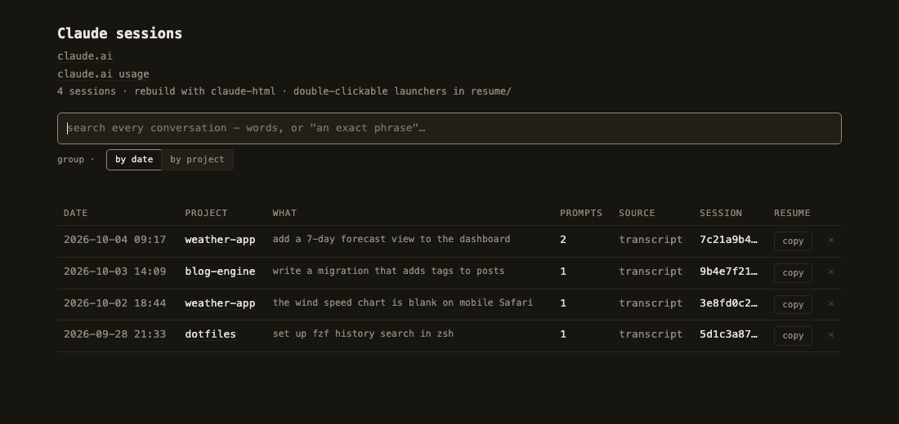
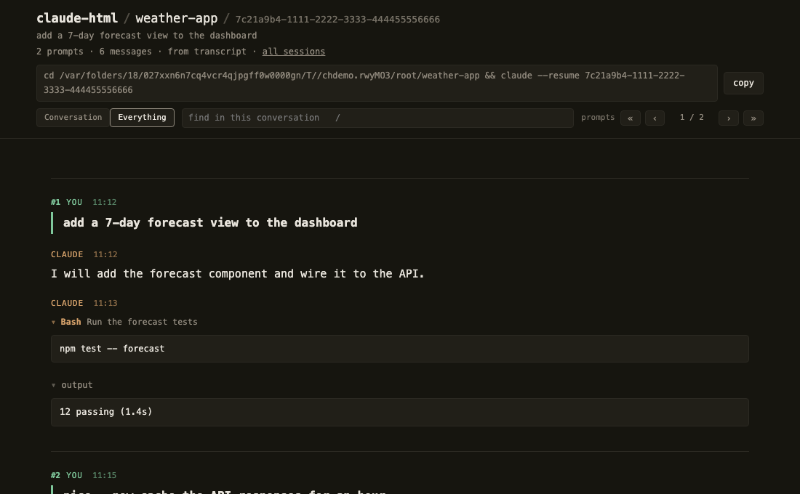

# claude-html

[](https://github.com/pier0074/claude-html/actions/workflows/test.yml)


[](LICENSE)
[](https://github.com/pier0074/claude-html/stargazers)

Every Claude Code conversation you have, kept forever and readable in your
browser — searchable, diffed, resumable with one copy-paste command. One-line
install, zero dependencies, and it builds itself while you work.





## Why

Claude Code deletes transcripts after 30 days, and raw JSONL is unreadable.
This keeps everything, locally, as plain HTML files: no server, no database,
no dependencies, and not one byte leaves your machine.

- **Automatic** — hooks save after every reply (`Stop`), when a session ends
  (`SessionEnd`) and before the context is compacted (`PreCompact`), so a page
  is never more than one reply behind — and they are **added beside** any hooks
  you already have, never over them
- **Search everything** — full text across every conversation, results jump to the exact message
- **Readable** — numbered prompts, labelled tool calls, real diffs; one click hides all the machinery
- **Resumable** — every page carries its `cd … && claude --resume …` command
  with a copy button: paste it into a terminal and you are back in the session
- **Permanent** — archives live beside your projects, past the 30-day cleanup
- **Private** — static files, zero network requests; light and dark, with a ◐ toggle

## Install

```bash
git clone https://github.com/pier0074/claude-html ~/claude-html
cd ~/claude-html && ./install.sh
```

No questions asked, nothing else to install: macOS needs nothing at all,
Linux only `node`, which a machine running Claude Code already has.

**Where you clone it is the configuration.** The folder you clone into is
where the pages are written — `index.html` appears right there — and its
*parent* becomes the projects root: every Claude Code session started
anywhere under it is archived, whatever the project. Clone into
`~/Sites/claude-html` and everything under `~/Sites` is covered; clone into
`~/claude-html` and everything under your home is. To set either explicitly:
`./install.sh --out DIR --root DIR`.

The installer only adds. Its hooks are appended beside whatever is already in
your `settings.json`, nothing of yours is rewritten, and
`./install.sh --uninstall` removes exactly its own hooks and nothing else.

## Use

Day to day: nothing. The hooks keep every page current while you work — just
open `index.html` and read. The command exists for the exceptions:

```bash
claude-html              # rebuild now instead of waiting for the next reply, and open the index
claude-html --force      # rebuild every page from scratch, e.g. after updating the tool
bash tests/run-all.sh    # the test suite, on macOS and on Linux
```

## Uninstall

```bash
cd ~/claude-html && ./install.sh --uninstall
```

That removes what was installed — the `claude-html` command, the helper app
and the hooks it added (only its own; the rest of your `settings.json` is
untouched) — and deliberately keeps what is yours: the pages, the archives
and your `cleanupPeriodDays`. Nothing saves anymore from that point; what was
already saved stays readable.

To erase every trace as well:

- delete the clone folder — the tool and all its pages go with it
- delete `~/.claude/claude-html.conf` (and `~/.claude/claude-html.hidden`, if you hid claude.ai chats)
- the permanent archives live in each project, in `<project>/.claude/.claude-conversations/` — delete those folders to lose the conversations for good
- `cleanupPeriodDays` in `~/.claude/settings.json` stays at 3650 (set only if you had none); put it back to taste

## More

**[docs/DETAILS.md](docs/DETAILS.md)** — how saving works and why no message
can be lost, search, deleting a conversation to the Trash, sub-agents,
claude.ai exports, configuration, and what is macOS-only.

## License

MIT. Not affiliated with or endorsed by Anthropic; Claude is their trademark.
